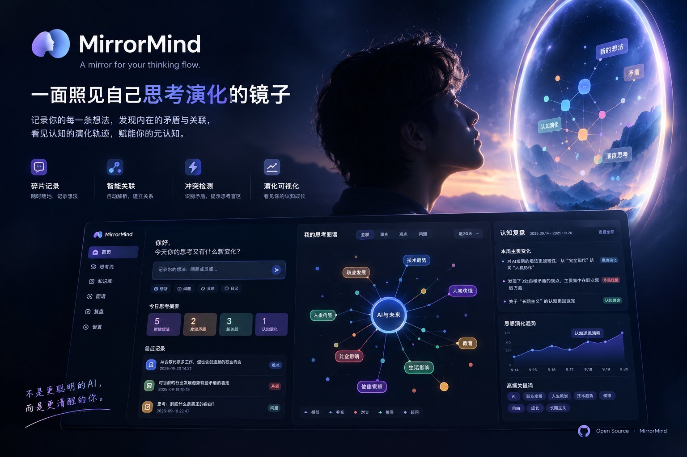
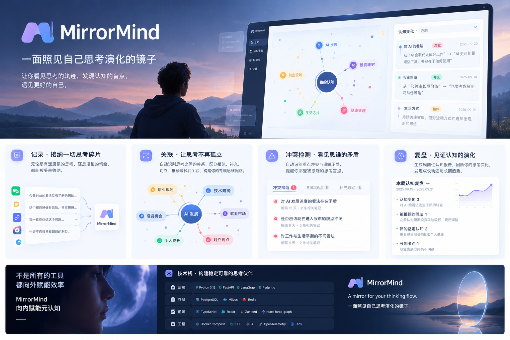
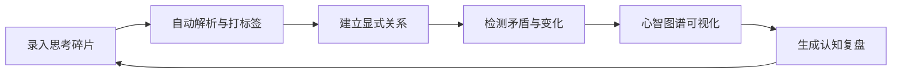
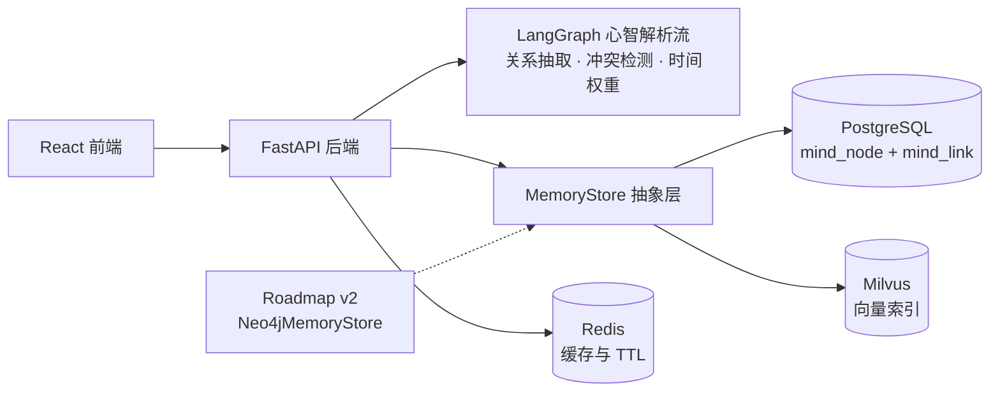

<div align="center">


# MirrorMind

**A mirror for your thinking flow.**

一面照见自己思考演化的镜子。


</div>

<p align="center">
  
</p>


> 下方能力与启动方式描述的是 v0.1 目标，不是已经可运行的版本。

---

## 为什么是现在

在 AI 越来越擅长替人给出答案的时代，人最核心的竞争力反而会回归 **独立思考的能力**。

大多数 AI 工具都在做“替你思考”的事——给你结论、帮你总结、优化你的输出。长期来看，这反而可能弱化人的独立思考能力。MirrorMind 选择完全相反的路：**不替你思考，不告诉你什么是对的，只忠实地呈现你的思考过程，帮你更清醒地思考。**

它赋能的是 **元认知**——也就是“对自己思考的思考”，这是 AI 无法替代的底层能力。因此，MirrorMind 不是一个帮你“更快做事”的工具，而是一个帮你 **更清醒地活着** 的工具。

---

## 为什么需要 MirrorMind

我们并不缺少记录工具，缺少的是一面能看见“思考如何变化”的镜子。

| 现实问题 | 常见工具的局限 | MirrorMind 的回答 |
|---|---|---|
| 想法散落在微信、备忘录、浏览器和脑子里 | 信息来去匆匆，没有统一收容 | 接纳混乱、零散的思考碎片，不要求规整输入 |
| 笔记只保留“今天的我写了什么” | 状态是快照，难以回看认知如何形成 | 保留旧观点与版本链，不因新观点出现而删除历史 |
| AI 越来越擅长给出答案 | 多数工具优化输出，却不展示思考中的冲突 | 显式检测矛盾、摇摆与长期未收敛的问题 |
| 关联通常只是“关键词相近” | 相似性会掩盖对立、推导和补充关系 | 把「对立」作为一等关系，不把矛盾平滑抹掉 |

MirrorMind 的核心不是知识管理，而是 **元认知（对自己思考的思考）**。

---

## 核心能力

<p align="center">
  
</p>

### 1. 记录 · 接纳一切思考碎片

无论是完整观点、临时情绪，还是尚未成形的疑问，都可以直接进入系统。

### 2. 关联 · 让思考不再孤立

自动识别碎片之间的关系，区分 **相似、补充、对立、推导、疑问**，逐步形成个人的思想网络。

### 3. 冲突检测 · 看见思维矛盾

不回避前后不一致，主动提醒“你曾持相反观点”“这个问题反复出现”“某项判断正在发生偏移”。

### 4. 复盘 · 见证认知演化

周期性生成认知变化报告：什么被推翻、什么逐渐坚定、什么长期卡住，以及观点如何随时间迁移。

### 5. 图谱 · 看见思考结构

以节点大小表示记忆权重，以颜色区分关系类型；点击节点可回溯观点版本与演化路径。

---

## 产品闭环



MirrorMind 不抹平矛盾，而是把矛盾视为理解自己思考过程的重要证据。

---

## 设计原则

### 观察，而不是裁决

MirrorMind 可以指出冲突，但不替用户判断谁对谁错。最终解释权永远属于用户。

### 保留历史，而不是覆盖状态

不删除旧节点。新观点以新节点和“推翻 / 对立”关系加入，让认知演化本身成为可回看的数据。

### 对立优先，而不是只做相似推荐

语义相似只是关系的一种。真正有价值的往往是那些彼此冲突、相互推导或长期未闭合的观点。

### 人始终在回路中

LLM 负责发现候选关系，用户保留修正、确认和否决的权利。

---

## 目标架构



MVP 采用 **PostgreSQL 关系表 + Milvus 向量检索** 实现轻量图能力，不引入重型知识图谱。<br>
`MemoryStore` 抽象层为未来可插拔图谱后端保留空间。

### 技术栈

| 层级 | 技术 |
|---|---|
| 后端 | Python 3.12 · FastAPI · LangGraph · Pydantic v2 |
| 数据 | PostgreSQL · Milvus · Redis |
| 检索 | 自研 BM25 + BGE 稠密向量混合召回 |
| 前端 | TypeScript · React 19 · Zustand · react-force-graph |
| 工程 | Docker Compose · SSE · OpenTelemetry · pytest |

---

## MVP 范围

v0.1 只验证一条最小闭环：**能否稳定地把“看见思考矛盾与演化”跑通。**

- [x] 产品定位、边界与核心数据模型
- [x] 首版 README、品牌概念与架构方向
- [ ] 仓库骨架与 Docker Compose
- [ ] `mind_node` / `mind_link` 数据层与 `MemoryStore`
- [ ] BM25 + BGE 混合召回
- [ ] LangGraph 解析、关系抽取与冲突检测
- [ ] 时间衰减权重与版本链
- [ ] FastAPI、SSE 与前端联调
- [ ] 录入页、心智图谱与冲突面板

明确不在 MVP 中：重型知识图谱、用户系统、网页抓取、批量导入、云端部署、付费与完整评测平台。

---

## 快速开始

> 当前仓库尚未提供可运行代码，以下为 v0.1 实现后的目标使用方式。

```bash
git clone https://github.com/Hacker-me18/mirror-mind.git
cd mirror-mind
cp .env.example .env
docker compose up --build
```

计划中的目录结构：

```text
mirror-mind/
├── README.md
├── assets/
├── backend/
├── frontend/
├── docs/
├── scripts/
├── docker-compose.yml
└── .env.example
```

---

## Roadmap

| 阶段 | 目标 |
|---|---|
| **v0.1 ·  MVP** | 单用户录入、自动关联、冲突检测、基础图谱、周度复盘、Docker 一键启动 |
| **v0.2 · ** | 完善节点版本管理、冲突消解参数、记忆质量评分、批量导入与图谱交互 |
| **v1.0 · ** | 可插拔 Neo4j 后端、冲突识别评测、记忆推理链路、心智报告导出、多用户 |
| **v2.0 · ** | 本地优先离线模式、模型路由、插件系统与更多元认知分析视图 |

---

## Known Limitations

- MirrorMind **检测矛盾，但不判断对错**，最终判断权始终属于用户。
- LLM 关系抽取可能出现幻觉，系统需要提供人工修正入口，结果仅供参考。
- MVP 使用轻量图结构而非重型知识图谱，复杂多跳推理能力有限。
- 产品服务于“慢价值”的元认知反思，而不是即时生产力提升，用户圈层天然小众。

---

<div align="center">

**不是更聪明的 AI，而是更清醒的你。**

MirrorMind · A mirror for your thinking flow.

<sub>Project initialized on 2026-10-07 · License TBD</sub>

</div>
